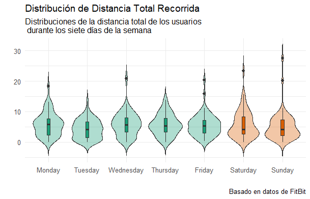
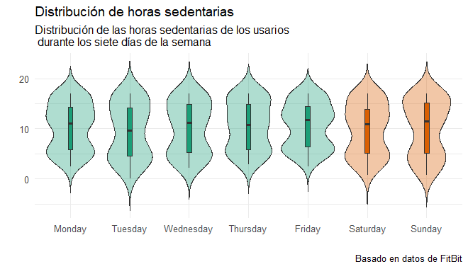

# **Sobre la empresa.**

Bellabeat es una empresa de alta tecnología que fabrica distintos productos inteligentes de alta tecnología, los cuales recopilan datos sobre actividad física, el sueño, el estrés y la salud reproductiva para proporcionar a las mujeres comocimientos sobre su salud personal y sus hábitos. Esta empresa fue fundada por Urška Sršen, quien también es directora creativa y el matemático Sando Mur.

## **Fases del análisis**

### *Preguntar*

-   **Business Task:** Identificar y aprovechar las tendencias de los datos de dispositivos inteligentes que no son de Bellabeat para mejorar las estrategias de marketing.

-   **Stakeholders o Interesados en el proyecto**

    1.  Urška Sršen Y Sando Mur, los cofundadores.
    2.  Equipo de análisis computacional de datos de marketing de Bellabeat

### *Preparar.*

1.  **Datos utilizados.**: El conjunto de datos con el que se realizó el análisis fue obtenido de Kaggle, y puede consultarse en [FitBit Fitness Tracker Data](https://www.kaggle.com/datdasets/arashnic/fitbit/data). Este conjunto esta disponible gracias a [Möbius](https://www.kaggle.com/arashnic)

2.  **Accesibilidad y privacidad.**: Los datos son de dominio público.

3.  **Detalles del conjunto de datos**: Este conjunto de datos fue generado por encuestados a través de una encuesta distribuida mediante Amazon Mechanical Turk entre el 03.12.2016 y el 05.12.2016. Treinta usuarios elegibles de FitBit dieron su consentimiento para proporcionar datos personales de seguimiento, incluyendo resultados a nivel de minutos para la actividad física, la frecuencia cardíaca y el monitoreo del sueño.

4.  **Organización de los datos**: El conjunto de datos de FitBit consiste de 11 tablas los cuales son archivos de tipo csv (comma separated values), dos tablas están en formato ancho y las demás en formato largo. Además, las tablas presentan distintos formatos de tiempo (segundos, minutos, horas) y están indicados en los nombre de las tablas, en caso de tenerlo. Por último, este conjunto de datos está enfocado en datos de ritmo cardiaco, cuenta de pasos, calorias, etc., y mediante una visualización rápida se puede observar que los datos pasaron mediante un tratamiento el cual tiene algunas inconsistencias que se pueden corregir.

5.  **Credibilidad de los datos.**: Dado la limitación de contar unicamente con una muestra de treinta usuarios, cuyo sexo es desconocido y el hecho de no contar con información de la empresa, esto podría generar sesgos de muestreo. Otro problema que se puede encontrar es que los datos no son actuales, son del año 2016. Además, pese a que el registro son obtenidos de 30 usuarios, se encontro que las tablas de datos contaban con mas o incluso menos de treinta usuarios.

### *Procesar*

-   **Herramientas** Se utilizó el lenguaje de programación R para verificar la integridad de los datos, editar informaciones inconsistentes, limpiar los datos (en caso de ser necesario) y realizar el análisis.

-   **Tablas de datos utilizados**. No se utilizó todas las tablas, ya que otras tablas contienen información similar a otras pero medidos en intervalos de tiempo distintos. Las tablas utilizadas son las siguientes:

    1.  dailyActivity_merged.csv
    2.  hourlyCalories_merged.csv
    3.  hourlyIntensities_merged.csv
    4.  minuteSleep_merged.csv
    5.  hourlySteps_merged.csv

-   **Previsualizando algunas tablas**

    ```{r echo=TRUE}
      daily_activity <- read.csv("datasets/dailyActivity_merged.csv")
      head(daily_activity, 3)
    ```

    ```{r echo=TRUE}
      hourly_intensities <-  read.csv("./datasets/hourlyIntensities_merged.csv")
      head(hourly_intensities, 3)
    ```

    ```{r echo=TRUE}
      minute_sleep <- read.csv("./datasets/minuteSleep_merged.csv") 
      head(minute_sleep, 3)
    ```

    Observaciones:

    1.  Los nombres de las tablas no son completamente consistentes, ya que al final contiene la palabra "merged" y esto no aporta al análisis.
    2.  Los nombres de algunas columnas de varias tablas no siguen el estándar de nomenclatura.
    3.  La tabla llamada *minuteSleep_merged.csv* contiene una columna llamada *value* el cual solo contiene tres valores los cuales no se especifica que significan, por lo tanto, se ha decidido no utilizar dicha tabla.

    Bajo la observación 3, las tablas utilizadas en el análisis son:

    ```{r eval=FALSE}
    daily_activity <-  read.csv("./datasets/dailyActivity_merged.csv")
    hourly_calories <-  read.csv("./datasets/hourlyCalories_merged.csv") 
    hourly_intensities <-  read.csv("./datasets/hourlyIntensities_merged.csv")
    hourly_steps <-  read.csv("./datasets/hourlySteps_merged.csv")
    heartrate_seconds <- read.csv("./datasets/heartrate_seconds_merged.csv")
    ```

-   **Arreglando el formato de fecha**

    En todas las tablas el tipo de dato de las fechas y tiempos eran de tipo *char,* esto fue arreglado con el siguiente código.

    ```{r eval=FALSE}
    daily_activity$ActivityDate <- as.Date(daily_activity$ActivityDate, "%m/%d/%Y")
    hourly_calories$ActivityHour <- mdy_hms(hourly_calories$ActivityHour)
    hourly_intensities$ActivityHour <- mdy_hms(hourly_intensities$ActivityHour)
    hourly_steps$ActivityHour <- mdy_hms(hourly_steps$ActivityHour)
    heartrate_seconds$Time <- mdy_hms(heartrate_seconds$Time)
    ```

-   **Formateo de columnas.**

    El siguiente código arregla el formato del nombre de las columnas.

    ```{r eval=FALSE}
    convert_name <- function(df){
      df %>%  
        rename_all(~str_replace_all(., "([A-Z])", "_\\1") %>%  # add "_" between upper       
                     str_replace_all(., "^_", "") %>%           # remove "_" at the beginning
                     str_to_lower(.)                            # finally convert to lowercase
        )
    }

    daily_activity <- convert_name(daily_activity)
    hourly_calories <-  convert_name(hourly_calories)
    hourly_intensities <- convert_name(hourly_intensities)
    hourly_steps <- convert_name(hourly_steps)
    heartrate_seconds <- convert_name(heartrate_seconds)

    ```

-   **Uniendo tablas.**

    Primero, se resumió las tablas que tenian por nombre *hourly* en una sola, estas tablas coinciden en las columnas *id, activity_hour.*

    ```{r eval=FALSE}

    # merge the hourlys tables
    merge_hourly  = hourly_calories %>% 
      merge(hourly_intensities, by = c("id", "activity_hour")) %>% 
      merge(hourly_steps, by = c("id", "activity_hour")) 
    ```

    Luego se realizó lo siguiente:

    1.  A la tabla anteriormente creada, la columna que contenía información de la hora y la fecha se separó en dos, en fecha y hora.
    2.  Tanto a las tablas *merge_hourly* y *daily_activity* se el agregaron columnas que indican que día fue realizado el registro y si era fin de semana o no.

    El código es siguiente:

    ```{r eval=FALSE}
    Sys.setlocale("LC_TIME", "en_US.UTF-8")

    merge_hourly <- merge_hourly %>%  
        mutate(date = as.Date(activity_hour), 
               time = format(activity_hour, format = "%H:%M:%S")) %>%
        mutate(day = weekdays(date), 
               is_weekend = ifelse( weekdays(date) %in% c("Saturday", "Sunday"), "Yes", "No")) %>% 
        select(-activity_hour) 


    daily_activity <-  daily_activity %>% 
        mutate(day = weekdays(activity_date), 
               is_weekend = ifelse( weekdays(activity_date) %in% c("Saturday", "Sunday"), "Yes", "No")) 
    ```

    Por otro lado, para la tabla *heartrate_seconds* se le realizaron las siguientes operaciones

    1.  Se creo una tabla el cual resume el promedio del ritmo cardiaco por hora. 
    2.  A esta nueva tabla se le unio la otra tabla que resume la intensidad, pasos y calorias por hora. Además, se filtra aquellas filas cuya intensidad es cero, pues esto indica que el usuario está dormido o bien, no está realizando alguna actividad.
    3.  Se crea una nueva columna el cual clasifica cada fila de la tabla de acuerdo al tipo de intensidad: *Low*, si la intensidad está debajo del promedio; 'Normal', si la intensidad es mayor o igual al promedio y menor o igual a 60; y 'High', si la intensidad es mayor   

    El código de lo mencionado anteriormente es el siguiente:

    ```{r eval=FALSE}

    # Summarise average heart rate per hour
      mean_intensity <- mean(merge_hourly$total_intensity[merge_hourly$total_intensity > 0], na.rm = TRUE)
    
    merge_heart_rate <-  hourly_heart_rate %>%  
      inner_join(merge_hourly, by = c("id", "date", "time")) %>%
      filter(average_intensity > 0) %>% 
      mutate(intensity_label = case_when(
        total_intensity < mean_intensity ~ "Low",
        total_intensity >= mean_intensity & total_intensity <= 60 ~ "Moderate",
        total_intensity > 60 ~ "High"
      )) %>% 
      pivot_longer(cols = c("average_heart_rate", "min_heart_rate", "max_heart_rate"),
                   names_to = "type",
                   values_to = 'hr_value') %>% 
      mutate(time = hms::as_hms(time))


    ```

    Por último, se creo otra tabla a partir de *merge_hourly* el cual contiene un resumen de la media de pasos dado en cada hora del dia.

    ```{r eval = FALSE}
    hourly_summary <-  merge_hourly %>%
      group_by(time, is_weekend) %>% 
      summarise(median_total_step = median(step_total)) %>%  ungroup()
    ```

### *Analizar - Compartir*

#### 1. Distribución de pasos por hora


Del gráfico anterior podemos destacar los siguiente:

-   Durante la semana, hay usuarios que comienzan su día a las 7:00 am, mientras que los fines de semana tienden ha empezar a las 9:00 am.

-   Durante la semana, hay dos momentos en el que los usuarios tienen una mayor actividad, Por otro lado, los fines de semana no hay mucha variacion en los pasos que dan desde las 11:00 horas, hasta las 17:00 horas.

-   Los fines de semana se da una menor cantidada de pasos.

#### 2. Distancia recorrida.



De este grafico destacamos lo siguiente:

-   La media de las distancia recorrida de los dias martes, sábado y domingo es menor a 5 km.
-   Los dias lunes, miércoles, jueves y viernes son los días en que la distancia media recorrida es mayor a 5km.

#### 3. Horas de sedentarismo.



Destacamos lo siguiente:

-   Similitud de horas sedentarias durante los días Lunes y Viernes.

-   A excepción del martes, se registró que la media de horas sedentarias de los usuarios está por encima de las 10 horas.

-   Se puede observar que en toda la semana hay una concentración de usuarios que llegan a pasar más de 10 horas de sedentarismo, siendo los Lunes, Viernes y Domingos los más considerables.

### 4. Frecuencia cardiaca y calorias quemadas.


Destacamos lo siguiente:

-   Los usuarios que registraron una baja intensidad están mayormente concentrado en frecuencias cardiacas entre 50 a 100 bpm, y llgar a quemar más de 75 calorias.
-   Los usuarios que registraron una intensidad moderada, muestra una ligera concetración en frecuencias cardiacas entre 50 a 199 bpm, y llegar a quemar más de 150 calorias.
-   Para los usuarios que registraron una intensidad fuerte, los datos no tienden a estar concetrados en un intervalo específico. Por otro lado, vemos como hay usuarios que quemaron una cantidad fuerte alta de calorias pero con frecuencia cardiaca menor a 100 bpm

- No hay relación fuerte entre la frecuencia cardiaca y las calorias quemadas, pues esto indica que hay usuarios que tienen una frecuencia alta y poca intesidad de actividad, o bien, una frecuencia baja y una actividad moderada


# Conclusiones (actuar).

Recordemos que Bellabeat es una empresa que busca el bienestar de la mujer, proporcionando datos sobre su salud personal y sus hábitos. La empresa recopila información relacionada con su actividad física, sueño, estrés y salud reproductiva.

Por otro lado, en cuanto a los datos de Fitbit, solo fue posible analizar la información sobre la actividad física y el ritmo cardíaco, ya que los datos sobre el sueño no están correctamente documentados. Afortunadamente, gracias a estudios científicos, sabemos la importancia de la actividad física para mejorar la calidad del sueño y el manejo del estrés.

A partir de los datos analizados de Fitbit, podemos implementar las siguientes estrategias en los dispositivos inteligentes de Bellabeat:

-   **Sistema de objetivos y rencompesas**: Para la aplicación de Bellabeat, se podría agregar una función que muestre una lista de objetivos por cumplir, ya sean diarios, semanales o mensuales, e incluso personalizados, de acuerdo a las necesidades del usuario. Estos objetivos pueden incluir: dar más de 5000 pasos diarios, quemar más de 200 calorías, o tener menos de 12 horas de sedentarismo al día, por dar un ejemplo. Las recompensas se obtendrían al cumplir los objetivos, y estas podrían ser: descuentos en la membresía Bellabeat, descuentos en productos Bellabeat, o incluso la posibilidad de ganar uno de manera gratuita.

- **Alertas de emergencia**. Actualmente, el dispositivo Leaf se conecta con la aplicación de Bellabeat para realizar un seguimiento de la actividad física, el sueño y el estrés. La alerta de emergencia tendría como función alertar al usuario sobre anomalías en su frecuencia cardíaca.

- **Predicción de sueño**: Para la aplicación de BellaBeat se podria agregar una función que prediga la calidad de sueño del usuario a partir de la actividad fisica realizada durante el dia, o bien, dar una recomendación sobre cuanta actividad física le falta al usuario para que pueda dormir saludablemente.


