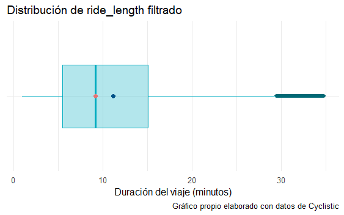

# Introducción

## Sobre la empresa

Cyclistic es un programa de de **bicicletas compartidas** en Chicago que ha crecido desde 2016 hasta contar con 5,824 bicicletas y 692 estaciones. Su estratégia de marketing se ha basado en atraer diversos segmentos de consumidores a través de planes flexibles de precios, incluyendo pases de un solo viaje y membresías anuales. Los clientes que optan por pases ocasionales se denominan **ciclistas ocasionales**, mientras aquellos clientes que cuentan con membresías anuales son considerados **miembros de Cyclistic**.

Los analistas financieros que determinaros que los miembros de Cyclistic generan mayores beneficios que los ciclistas ocasionales. Por ello, la directora de marketing Lily Moreno, busca estrategias para convertir a más ciclistas ocasionales en miembros de Cyclistic. Para lograr este objetivo, es necesario estudiar las diferencias entre ambos grupos, los factores que motivan a los ciclistas ocasionales a adquirir una membresia y el impacto de los medios digitales en su decisión. 


---
# Enfoque

## 1. Preguntar

### Business Task

> *Diseñar estrategias de marketing orientadas para en convertir los ciclistas ocasionales en miembros anuales de Cyclistic*

### Preguntas clave del análisis

Las siguientes preguntas servirá como guia para desarrollar el proyecto.

1. ¿En qué se diferencian los socios anuales y los ciclistas ocasionales con respecto al uso de las bicicletas de Cyclistic? 
2. ¿Por qué los ciclistas ocasionales comprarían membresías anuales de Cyclistic? 
3. ¿Cómo puede usar Cyclistic los medios digitales para influenciar a los ciclistas ocasionales a convertirse en miembros?

### Stakeholders o interesados en el proyecto.

Los principales interesados son:

1. **Lily Moreno**  Gerente y directora de marketing. Es responsable del desarrollo de campañas e iniciativas para promover el programa de bicicletas compartidas. Tiene un alto interés en el proyecto, pero no es quien aprueba el programa de marketing recomendado. 
2. **Equipo Ejecutivos de Cyclistic** Son quienes aprueban el programa de marketing recomendado. Mantener satisfechos.
3. **Equipo de análisis computacional de datos de marketing de Cyclistic** Un equipo de analistas de datos que se encargan de recopilar, analizar e informar datos que ayudan a conducir la estrategia de marketing de Cyclistic. Monitorean constantemente el avance del proyecto.


---

## 2. Preparar

### 2.1 Sobre el conjunto de datos

El conjunto de datos con el que se realizara el análisis fueron proporcionados por 
[Motivate International Inc](https://divvy-tripdata.s3.amazonaws.com/index.html) y están bajo esta [licencia](https://divvybikes.com/data-license-agreement). Esto significa que los datos son públicos los cuales se pueden  copiar, modificar, analizar, distribuir o usar los datos de cualquier forma legal. Sin embargo, por cuestiones de privacidad está prohibido usar información de identificación personal de los ciclistas. 

### 2.3 Detalles de los datos 


El conjunto de datos está formado por doce archivos `csv`, los cuales forma el histórico del año 2024.

Cada tabla contiene información sobre los viajes realizados por los usuarios, cuya información del usuario es anónima, e incluye:

- Fecha y hora de inicio de viaje
- Fecha y hora de fin de viaje
- Estación de inicio
- Estación de termino
- Tipo de usuario

---

## 3. Procesar

### 3.1 Herramientas

Las herramientas que se utilizarán en los siguientes procesos son: 

1. **Spreadsheet (Excel u hojas de cálculo de Google).** Para una inspección rápida de los datos antes del procesamiento y después de procesar, para garantizar la integridad de los datos.
2. **R**. Para realizar los procesos de limpieza y procesamiento de datos.
3. **Power BI**: Para realizar visualizaciones de los hallazgos.

### 3.2 Exploración de los datos[^1]

Para las doce tablas se verifico que todas contienen el mismo nombre en sus columnas. Esto Fue verificado con el siguiente código[^2]:

```R
tables_info = list()
for(i in 1:12){
  csv_name <- paste0(datapath,file_year,file_months[i],"-divvy-tripdata.csv")
  data_tmp <-  read.csv(file = csv_name,nrows = 3) 
  cols_names_tmp <- colnames(data_tmp)
  table_cols <- paste0(cols_names_tmp)
  table_info <-  table_info %>% 
                 append(paste0("|", paste0(cols_names_tmp, collapse = "|"), "|"))
}

tables_info <- length(unique(table_info)) == 1 # TRUE si las columnas de los archivos son iguales
```

Una vez verificado esto se procedió a verificar si el tipo de dato de las columnas es el correcto. Para todas las columnas se obtuvo la siguiente tabla

|  Nombre de columna   |   Tipo    | Descripción                                    |
| :------------------: | :-------: | ---------------------------------------------- |
|      `ride_id`       | character | ID único designado a cada unidad               |
|   `rideable_type`    | character | Biciclleta clásica, electrica o scooter        |
|     `started_at`     | character | Fecha y hora de inicio de viaje                |
|      `ended_at`      | character | Fecha y hora de fin de viaje                   |
| `start_station_name` | character | Nombre de la estación del comienzo de viaje    |
|  `start_station_id`  | character | ID de la estación donde comenzó el viaje       |
|  `end_station_name`  | character | Nombre de la estación de finalización de viaje |
|   `end_station_id`   | character | ID de la estación donde termino el viaje       |
|     `start_lat`      |  double   | Latitud de la estación inicial                 |
|     `start_lng`      |  double   | Longitud de la estación inicial                |
|      `end_lat`       |  double   | Latitud de la estación final                   |
|      `end_lng`       |  double   | Longitud de la estación final                  |
|   `member_casual`    | character | Tipo de membresia que posee                    |

Luego, para agilizar los procesos de ajuste de tipo de las columnas y la limpieza de datos, se decidió unir todas las tablas en solo una. Esto es posible debido a que las tablas presentan una consistencia inicial en el nombre las columnas y en el tipo de columnas que presentan.

El proceso para unir todas las tablas en solo una fue realizado mediante el siguiente código:

```R
# data_cp es una tabla arbitraria de nuestro conjunto de datos,
n <-  length(colnames(data_cp))
all_trips <-  data.frame(matrix(ncol = n, nrow = 0))
colnames(all_trips) <- colnames((data_cp))
for(i in 1:12){
  # file_year <- "2024"
  csv_name <- paste0(datapath,file_year,file_months[i],"-divvy-tripdata.csv")
  data_tmp <-  read.csv(file = csv_name)
  all_trips <- rbind(all_trips,data_tmp) 
}
```

Así se obtuvo una tabla con 5860568 renglones y 13 columnas.

Finalmente, verificamos los datos únicos las columnas `rideable_tipe` y `member_casual` que nos interesa realizar el análisis. Se obtuvo

| Columna         | Elementos únicos                                     |
| --------------- | ---------------------------------------------------- |
| `rideable_type` | "electric_bike", "classic_bike" y "electric_scooter" |
| `member_casual` | "member" y "casual"                                  |

Por lo tanto, no es necesario realizar algún ajuste a dichas columnas.
### 3.3 Limpieza y transformación de los datos

Antes de realizar las respectivas modificaciones a la tabla `all_trips`, se trabajó sobre una copia llamada `all_trips_table` el cual es una versión mejorada de un *dataframe* y es proporcionada por la librería [data.table](https://cran.r-project.org/web/packages/data.table/).

Las operaciones que se le realizaron a la tabla `all_trips_table` fueron:

#### 3.3.1 **Agregado columnas**.

Se agregaron nuevas columnas a partir de la columna `started_at` y `ended_at`. Adicionalmente se agrego una columna llamada `ride_length` que indica la duración del servicio en minutos.
#### 3.3.2 **Agregando datos faltantes**.

En las columnas `start_station_name` y `end_station_name` se encontraron nombre vacíos, estos valores fueron llenados por el valor `unknown station`.
#### 3.3.3 **Limpieza de datos nulos, duplicados y columnas**.

Al revisar la tabla, no se encontraron elementos repetidos ni elementos nulos. Además, se eliminaron las columnas que describen latitud y longitud de las estaciones de inicio y de termino.
#### 3.3.4 **Limitando valores de `ride_length`**.

Después de haber creado esta columna es posible encontrar algunas inconsistencias. Primero, se encontraron valores negativos e iguales a cero los cuales representan al rededor del 0.01% de los datos, estos datos fueron eliminado. La distribución de valores que puede tomar esta variable es la siguiente:


Es evidente la presencia de outliers. Al revisar las estadísticas descriptivas de esta columna tenemos:

|  Mean   | Median |  Mode  |
| :-----: | :----: | :----: |
| 1039.15 | 583.00 | 300.00 |
Como se puede observar, hay una diferencia significativa entre estos valores.

Por lo tanto, se ha decidido limitar el rango de valores que puede tomar esta variable. La forma en que se van a limitar los valores es tomando aquellos viajes que sean mayores a tres minutos y que sean menores a 1440 minutos, es decir, un día. La distribución de los valores que puede tomar esta variable se puede ver en el siguiente gráfico:




Ahora, notamos que hay una mejor concentración de los datos. Las nuevas estadísticas descriptivas de esta columna son:

|  Mean  | Median |  Mode  |
| :----: | :----: | :----: |
| 567.49 | 500.00 | 300.00 |

El código de todo el proceso de limpieza puede consultarse en [data_cleaning.R](./data_cleaning.R)

## 4. Análisis


---

[^1]: El código completo de esta parte de la exploración puede consultarse [aquí](./data_integrity.R)
[^2]: Solo se cargan tres filas de datos para no sobrecargar la tarea.
