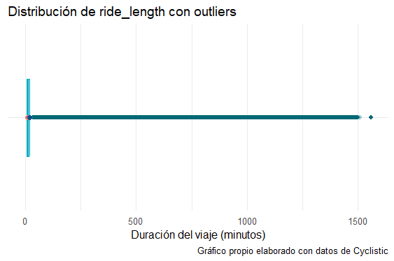

# Introducción

## Sobre la empresa

Cyclistic es un programa de de **bicicletas compartidas** en Chicago que ha crecido desde 2016 hasta contar con 5,824 bicicletas y 692 estaciones. Su estratégia de marketing se ha basado en atraer diversos segmentos de consumidores a través de planes flexibles de precios, incluyendo pases de un solo viaje y membresías anuales. Los clientes que optan por pases ocasionales se denominan **usuarios casuales**, mientras aquellos clientes que cuentan con membresías anuales son considerados **miembros de Cyclistic**.

Los analistas financieros que determinaros que los miembros de Cyclistic generan mayores beneficios que los ciclistas ocasionales. Por ello, la directora de marketing Lily Moreno, busca estrategias para convertir a más ciclistas ocasionales en miembros de Cyclistic. Para lograr este objetivo, es necesario estudiar las diferencias entre ambos grupos, los factores que motivan a los ciclistas ocasionales a adquirir una membresia y el impacto de los medios digitales en su decisión. 


---
# Enfoque

## 1. Preguntar

### Business Task

> *Diseñar estrategias de marketing orientadas para en convertir los ciclistas ocasionales en miembros anuales de Cyclistic*

### Preguntas clave del análisis

Las siguientes preguntas servirá como guia para desarrollar el proyecto.

1. ¿En qué se diferencian los socios anuales y los usuarios ocasionales con respecto al uso del servicio de Cyclistic? 
2. ¿Por qué los ciclistas ocasionales comprarían membresías anuales de Cyclistic? 
3. ¿Cómo puede usar Cyclistic los medios digitales para influenciar a los usuarios a convertirse en miembros?

### Stakeholders o interesados en el proyecto.

Los principales interesados son:

1. **Lily Moreno**  Gerente y directora de marketing. Es responsable del desarrollo de campañas e iniciativas para promover el programa de bicicletas compartidas. Tiene un alto interés en el proyecto, pero no es quien aprueba el programa de marketing recomendado. 
2. **Equipo Ejecutivos de Cyclistic** Son quienes aprueban el programa de marketing recomendado. Mantener satisfechos.

---

## 2. Preparar

### 2.1 Sobre el conjunto de datos

El conjunto de datos con el que se realizara el análisis fueron proporcionados por 
[Motivate International Inc](https://divvy-tripdata.s3.amazonaws.com/index.html) y están bajo esta [licencia](https://divvybikes.com/data-license-agreement). Esto significa que los datos son públicos los cuales se pueden  copiar, modificar, analizar, distribuir o usar los datos de cualquier forma legal. Sin embargo, por cuestiones de privacidad está prohibido usar información de identificación personal de los ciclistas. 

### 2.3 Detalles de los datos 

El conjunto de datos está formado por doce archivos `csv`, los cuales forma el histórico del año 2024.

Cada tabla contiene información sobre los viajes realizados por los usuarios, cuya información del usuario es anónima, e incluye:

- Fecha y hora de inicio de viaje
- Fecha y hora de fin de viaje
- Estación de inicio
- Estación de termino
- Tipo de usuario

---

## 3. Procesar

### 3.1 Herramientas

Las herramientas que se utilizarán en los siguientes procesos son: 

1. **Spreadsheet (Excel u hojas de cálculo de Google).** Para una inspección rápida de los datos antes del procesamiento y después de procesar, para garantizar la integridad de los datos.
2. **R**. Para realizar los procesos de procesamiento de datos, limpieza de datos, y realizar visualizaciones para el análisis.
### 3.2 Exploración de los datos

Para las doce tablas se verifico que todas contienen el mismo nombre en sus columnas. Esto fue verificado con el siguiente código:

```R
tables_info = list()
for(i in 1:12){
  csv_name <- paste0(datapath,file_year,file_months[i],"-divvy-tripdata.csv")
  data_tmp <-  read.csv(file = csv_name,nrows = 3) 
  cols_names_tmp <- colnames(data_tmp)
  table_cols <- paste0(cols_names_tmp)
  table_info <-  table_info %>% 
                 append(paste0("|", paste0(cols_names_tmp, collapse = "|"), "|"))
}

tables_info <- length(unique(table_info)) == 1 # TRUE si las columnas de los archivos son iguales
```

Una vez verificado esto se procedió a verificar si el tipo de dato de las columnas es el correcto. Para todas las columnas se obtuvo la siguiente tabla

|  Nombre de columna   |   Tipo    | Descripción                                    |
| :------------------: | :-------: | ---------------------------------------------- |
|      `ride_id`       | character | ID único designado a cada unidad               |
|   `rideable_type`    | character | Biciclleta clásica, electrica o scooter        |
|     `started_at`     | character | Fecha y hora de inicio de viaje                |
|      `ended_at`      | character | Fecha y hora de fin de viaje                   |
| `start_station_name` | character | Nombre de la estación del comienzo de viaje    |
|  `start_station_id`  | character | ID de la estación donde comenzó el viaje       |
|  `end_station_name`  | character | Nombre de la estación de finalización de viaje |
|   `end_station_id`   | character | ID de la estación donde termino el viaje       |
|     `start_lat`      |  double   | Latitud de la estación inicial                 |
|     `start_lng`      |  double   | Longitud de la estación inicial                |
|      `end_lat`       |  double   | Latitud de la estación final                   |
|      `end_lng`       |  double   | Longitud de la estación final                  |
|   `member_casual`    | character | Tipo de membresia que posee                    |

Luego, para agilizar los procesos de ajuste de tipo de las columnas y la limpieza de datos, se decidió unir todas las tablas en solo una. Esto es posible debido a que las tablas presentan una consistencia inicial en el nombre las columnas y en el tipo de columnas que presentan.

El proceso para unir todas las tablas en solo una fue realizado mediante el siguiente código:

```R
# data_cp es una tabla arbitraria de nuestro conjunto de datos,
n <-  length(colnames(data_cp))
all_trips <-  data.frame(matrix(ncol = n, nrow = 0))
colnames(all_trips) <- colnames((data_cp))
for(i in 1:12){
  # file_year <- "2024"
  csv_name <- paste0(datapath,file_year,file_months[i],"-divvy-tripdata.csv")
  data_tmp <-  read.csv(file = csv_name)
  all_trips <- rbind(all_trips,data_tmp) 
}
```

Así se obtuvo una tabla con 5860568 renglones y 13 columnas.

Finalmente, verificamos los datos únicos las columnas `rideable_tipe` y `member_casual` que nos interesa realizar el análisis. Se obtuvo

| Columna         | Elementos únicos                                     |
| --------------- | ---------------------------------------------------- |
| `rideable_type` | "electric_bike", "classic_bike" y "electric_scooter" |
| `member_casual` | "member" y "casual"                                  |

Por lo tanto, no es necesario realizar algún ajuste a dichas columnas. El proceso para verificar la integridad de los datos puede encontrase en [aqui](./data_integrity.R)
### 3.3 Limpieza y transformación de los datos

Antes de realizar las respectivas modificaciones a la tabla `all_trips`, se trabajó sobre una copia llamada `all_trips_table` el cual es una versión mejorada de un *dataframe* y es proporcionada por la librería [data.table](https://cran.r-project.org/web/packages/data.table/).

Las operaciones que se le realizaron a la tabla `all_trips_table` fueron:

#### 3.3.1 **Agregado columnas**.

Se agregaron nuevas columnas a partir de la columna `started_at` y `ended_at`, los cuales indican la fecha de inicio de viaje, el dia de inicio de viaje (por nombre y número) y la fecha del fin del viaje.

Adicionalmente se agregó una columna llamada `ride_length` el cual indica la duración del servicio en minutos.
#### 3.3.2 **Agregando datos faltantes**.

En las columnas `start_station_name` y `end_station_name` se encontraron nombre vacíos, estos valores fueron llenados por el valor `unknown station`.
#### 3.3.3 Limpieza de datos.

Al revisar la tabla, no se encontraron elementos repetidos ni elementos nulos. Además, se eliminaron las columnas que describen latitud y longitud de las estaciones de inicio y de termino.

También, se han eliminado aquellos viajes que iniciaron y terminaron en días distintos, ya que buscamos concentrarnos en el uso común del servicio.
#### 3.3.4 **Limitando valores de `ride_length`**.

Después de haber creado esta columna es posible encontrar algunas inconsistencias. Primero, se encontraron valores negativos e iguales a cero los cuales representan al rededor del 0.01% de los datos, estos datos fueron eliminado. La distribución de valores que puede tomar esta variable es la siguiente:




Es evidente la presencia de outliers. Al revisar las estadísticas descriptivas de esta columna tenemos:

|     Mean      |    Median    |     Mode     |
| :-----------: | :----------: | :----------: |
| 17.31 minutos | 9.72 minutos | 4.87 minutos |

Como se puede observar, hay una diferencia significativa entre estos valores.

Por lo tanto, se ha decidido utilizar la técnica [IQR](https://en.wikipedia.org/wiki/Interquartile_range) para filtrar los outliers. Para esta técnica se realizó una ligera variación en la selección de $Q_1$, se tomó el valor $Q_1 = 1$. es decir, se descartaron aquellos viajes que duraron menos de un minuto. Al utilizar esta técnica nuestra distribución de los datos nos quedo de la siguiente forma


Ahora, notamos una mejor distribución de los valores de la columna `ride_length`. 

|     Mean      |    Median    |     Mode     |
| :-----------: | :----------: | :----------: |
| 11.19 minutos | 9.18 minutos | 4.87 minutos |

El código de todo el proceso de limpieza puede consultarse en [data_cleaning.R](./data_cleaning.R) 

Después de haber realizado el proceso de limpieza nos hemos quedado con una tabla de 5,273,363 filas y 16 columnas

---

## 4. Análisis

Los siguientes gráficos son los hallazgos que se encontraron en los datos.
### 4.1 Frecuencia de los usuarios


> **Los usuarios *miembro* fueron los más abundantes durante el año 2024**

### 4.2 Transporte favorito de los usuarios


Encontramos lo siguiente

> 1. **Las *bicicletas eléctricas* fueron las más utilizadas tanto por los usuarios *casuales* y *miembros***
> 2. **Las *bicicletas clásicas* son el segundo transporte más utilizado y la diferencia entre la primera no es alta.**
> 3. **El *scooter* es el transporte menos usual de utilizar entre los dos tipos de usuarios**

### 4.3 Resumen anual

El siguiente gráfico está divido en tres paneles que representan:

1. El porcentaje usuarios que utilizaron el servicio mensualmente.
2. El conteo mensual de usuarios, indicando el mes con mayor número de usuarios activos
3. El conteo diario de usuarios (líneas tenues), así como el promedio semanal de usuarios.  (líneas anchas) 


De aqui podemos observar los siguiente:

> 1. Distribución de usuarios por mes:
> 	- **Los usuarios *miembros* representan la mayoría de los usuarios en todos los meses.**
> 	- **Hay un incremento en la participación de los  usuarios *casuales* en los meses de marzo a septiembre, siendo septiembre donde alcanza su máxima participación.**
> 2. Tendencia mensual del total de usuarios:
> 	- **Tanto los usuarios casuales como los miembros presentan un incremento en los meses de febrero y septiembre, siendo septiembre el mes con el mayor número de usuarios de ambos tipos.** 
> 	- **Hay una clara disminución en el número de usuarios activos durante los meses de octubre a enero, mostrando cómo los periodos otoño-invierno influyen en el uso del servicio.**
> 3. Evolución diaria y promedio semanal:
> 	- **Se observa una tendencia ascendente hasta mediados de año, con un mayor número de usuarios en verano.**
> 	- **La fluctuación diaria sugiere un patrón de uso constante con variaciones semanales, probablemente más uso en días específicos como fines de semana o días festivos.**

### 4.4 Tiempo medio del uso del servicio a lo largo del dia.

El siguiente grafico muestra como varia el tiempo medio del uso del servicio en una dia completo. El cálculo del tiempo medio a lo largo del día es obtenido tras segmentar al año por cuatro trimestres del año (T1, T2, T3 y T4), para observar con mejor claridad los patrones entre distintas temporadas.


Tenemos las siguientes observaciones clave de este gráfico:

> 1. Diferencias de tiempos entre los dos tipos de miembro
> 	- **Los usuarios *casuales* presentan un mayor tiempo medio de uso del servicio que los usuarios *miembros*.**
> 	- **Los *miembros* son quienes usan menos tiempo el servicio, lo cual podría indicar que estos realizan viajes más cortos, o bien, viajes diarios.**
> 1. Patrón de uso a lo largo del día
> 	- **Ambos miembros presentan un incremento en el tiempo medio de uso del servicio en las mañanas, siendo más visible en los usuarios *casuales*.**
> 	- **El tiempo de uso alcanza su máximo entre las 12:00 y 15:00 horas del día, para los usuarios casuales. Esto podría indicar que el uso del servicio es dedicado para actividades recreativas.**
> 	- **El tiempo medio de uso de los usuarios miembro tiene picos menos pronunciados durante el día. Su uso es más estable a lo largo del día.**
> 1. Variación por trimestre:
> 	- **Los trimestres T2 y T3 (segundo y tercero) son los que reportan un tiempo de uso mayor respecto a los otros trimestres. Esto podría estar relacionado con con las condiciones climáticas de la primavera y el verano.**
> 	- **Los trimestres T1 y T4 son los que reportaron menores tiempos de uso respecto a los demás. Esto sugiere que las condiciones climáticas del otoño y el invierno afectan en el uso del servicio.** 

### 4.5 Tiempo medio de uso durante la semana

El siguiente gráfico de calor muestra como varia el tiempo medio de uso de cada día de la semana durante cada mes del año 2024. Un color más claro indica mayor tiempo medio de uso, mientras que un color más oscuro indica menor tiempo medio de uso.


De este gráfico tenemos las siguientes observaciones:

> 1. Diferencias de tiempos entre los dos tipos de miembro
> 	- **Los usuarios casuales tienen tiempos medios de uso más altos, siendo los fines de semana los más activos, especialmente los meses de mayo a agosto.**
> 	- **Los usuarios miembro presentan un comportamiento más constante a lo largo del año, con ligeras variaciones, pero generalmente inferior respecto a los miembros casuales.**
> 1. Estacionalidad en el uso:
> 	- **El tiempo de uso aumenta durante la primavera y verano (abril-agosto), en especial para los usuarios casuales. Nuevamente, esto nos podría indicar que el uso es para fines recreativos en esta temporada.**
> 	- **Durante el otoño e invierno (septiembre-diciembre), el tiempo medio de uso disminuye, lo que sugiere menor interés por parte de los usuarios casuales debido a condiciones climáticas.**
> 1. Diferencias entre fines de semana:
> 	- **Usuarios casuales: El uso es más alto en los fines de semana, lo que refuerza la idea de que las bicicletas se usan más con fines recreativos.**
> 	- **Miembros: No muestran un incremento tan notable los fines de semana, lo que sugiere que utilizan el servicio de manera más homogénea a lo largo de la semana, posiblemente como parte de su rutina diaria (desplazamientos al trabajo o estudio).**


---

## 5. Recomendaciones

Después de revisar los resultados obtenidos tras el análisis de arriba, los siguientes son propuestas que pueden incentivar en convertir a los usuarios casuales en miembros, es decir, que adquieran la licencia anual de Cyclistic:

1. **Ofrecer descuentos atractivos durante el primer trimestre del año:**  
  Se observó que la actividad de los usuarios es baja en enero, pero comienza a aumentar a medida que mejoran las condiciones climáticas. Para aprovechar esta tendencia, se pueden ofrecer descuentos especiales en la membresía anual, incentivando a los usuarios casuales a suscribirse al inicio del año.
    
2. **Dar acceso temporal a las funciones exclusivas de los miembros:**
  Cyclistic podría ofrecer a los usuarios casuales un periodo de prueba con acceso a los beneficios de la membresía, con una duración mínima de una semana. Esta estrategia sería especialmente efectiva a finales de marzo y durante abril, dirigida a usuarios casuales con cierta antigüedad en el servicio, quienes podrían valorar más las ventajas de la suscripción.
    
3. **Implementar un sistema de puntos basado en la actividad:** 
  Se sugiere desarrollar un sistema de recompensas en el que los usuarios acumulen puntos según el tiempo de uso de bicicletas o scooters. Por ejemplo, 1 minuto de viaje podría equivaler a 10 puntos, y los fines de semana la tasa de acumulación podría incrementarse en un 50%. Estos puntos podrían canjearse por descuentos en membresías, productos exclusivos de Cyclistic o utilizarse en un sistema de ranking semanal que fomente una mayor participación de ambos tipos de usuarios.
    
4. **Organizar eventos exclusivos para miembros:**  
  Se identificó que los usuarios miembros presentan un uso más constante a lo largo del año y los días de la semana, lo que indica que integran el servicio en su rutina diaria. Para fortalecer su compromiso y atraer a usuarios casuales, Cyclistic podría organizar eventos como paseos grupales, desafíos de exploración o actividades temáticas por temporada. Estas iniciativas no solo aumentarían el *engagement* de los miembros, sino que también despertarían el interés de los usuarios casuales en la suscripción.

5. **Estrategia digital y retargeting en redes sociales**
   Cyclistic puede lanzar campañas personalizadas en redes sociales y correo electrónico, destacando los beneficios de la membresía anual. A través del *retargeting*, se pueden mostrar anuncios a usuarios casuales frecuentes con mensajes como:  
		_"Ahorra en tus viajes y disfruta de trayectos ilimitados con la membresía Cyclistic."_

---


<center>
<h2 style = "#4e4e4e">
¡Gracias por leer!
</h2>
</center>

